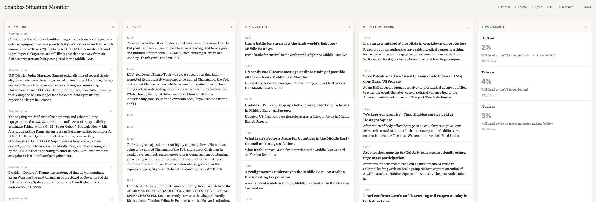

# Shabbos Situation Monitor

A hands-free, auto-refreshing local dashboard for monitoring Iran/Israel/Middle East news during Shabbos. No interaction required once started.

## Features

- **Twitter Feeds** - OSINT accounts tracking Middle East security (via Nitter)
- **Trump Truth Social** - Latest posts from Trump's Truth Social
- **Middle East News** - Google News aggregation for Iran/Israel coverage
- **Times of Israel** - RSS feed from TOI
- **Polymarket Odds** - Live prediction market probabilities for Iran strike scenarios
- **Auto-refresh** - Page refreshes every 5 minutes automatically
- **Auto-scroll** - Twitter column scrolls through all tweets within the refresh window

## Screenshot



Light, minimal design with earth-tone accents for easy reading.

## Quick Start (Mac)

**Step 1:** Open Terminal (press Cmd+Space, type "Terminal", hit Enter)

**Step 2:** Copy and paste these commands one at a time, pressing Enter after each:
```bash
cd ~/Desktop
git clone https://github.com/itsme188/Shabbos-Situation-Monitor.git
cd Shabbos-Situation-Monitor
./start.sh
```

**Step 3:** Open your browser and go to: **http://localhost:8080**

**Step 4:** Leave it open — it refreshes automatically every 5 minutes!

### Manual Setup (if the above doesn't work)

```bash
python3 -m venv venv
source venv/bin/activate
pip install -r requirements.txt
python server.py
```

## Configuration

Edit `config.py` to customize:

- `TWITTER_ACCOUNTS` - List of Twitter handles to monitor
- `REFRESH_INTERVAL` - How often to fetch new data (default: 300 seconds)
- `MAX_ITEMS_PER_FEED` - Maximum items shown per column
- `POLYMARKET_EVENT_SLUG` - Which Polymarket event to track

## Twitter Accounts Monitored

- @Faytuks - Iran/Israel news
- @sentdefender - OSINT
- @IntelCrab - Conflict tracking
- @AuroraIntel - Air/missile tracking
- @IsraelRadar_ - Israeli security
- @JoeTruzman - Gaza/Iran/Hezbollah
- And more...

## Tech Stack

- Python/Flask backend
- APScheduler for background fetching
- Nitter instances for Twitter data (no API key needed)
- Jinja2 templates
- Vanilla JS for auto-scroll

## Notes

- Twitter fetching uses Nitter instances which can be unreliable (503 errors are normal)
- The page auto-refreshes via `<meta http-equiv="refresh">` - no JavaScript polling
- Designed to run on localhost; not intended for production deployment

## License

MIT
