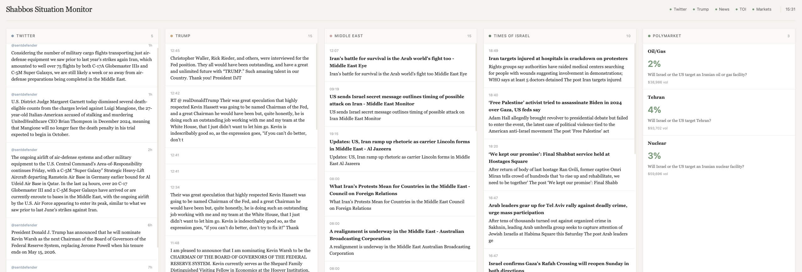

# Shabbos Situation Monitor

A hands-free, auto-refreshing local dashboard for monitoring Iran/Israel/Middle East news during Shabbos. No interaction required once started.

## Features

- **Twitter Feeds** - OSINT accounts tracking Middle East security (via Nitter)
- **Trump Truth Social** - Latest posts from Trump's Truth Social
- **Middle East News** - Google News aggregation for Iran/Israel coverage
- **Times of Israel** - RSS feed from TOI
- **Polymarket Odds** - Live prediction market probabilities for Iran strike scenarios
- **Auto-refresh** - Page refreshes every 5 minutes automatically
- **Auto-scroll** - Twitter column scrolls through all tweets within the refresh window

## Screenshot



Light, minimal design with earth-tone accents for easy reading.

## Quick Start (Mac)

**Step 1:** Open Terminal (press Cmd+Space, type "Terminal", hit Enter)

**Step 2:** Copy and paste these commands one at a time, pressing Enter after each:
```bash
cd ~/Desktop
git clone https://github.com/itsme188/Shabbos-Situation-Monitor.git
cd Shabbos-Situation-Monitor
./start.sh
```

**Step 3:** Open your browser and go to: **http://localhost:8080**

**Step 4:** Leave it open — it refreshes automatically every 5 minutes!

### Manual Setup (if the above doesn't work)

```bash
python3 -m venv venv
source venv/bin/activate
pip install -r requirements.txt
python server.py
```

### Troubleshooting: SSL Errors / No Fresh Data

If all feeds fail with `SSLError(PermissionError(1, 'Operation not permitted'))`, your Python's SSL library is too old for macOS. The fix is to use a newer Python (3.12+) which bundles its own OpenSSL.

**Important:** You must use the *full path* to Homebrew's Python when creating the venv. Running just `python3.12` may still resolve to the system Python, which won't fix the issue.

```bash
brew install python@3.12
cd ~/Desktop/Shabbos-Situation-Monitor
rm -rf venv
/opt/homebrew/bin/python3.12 -m venv venv
source venv/bin/activate
pip install -r requirements.txt
python server.py
```

**Why this happens:** macOS-bundled Python (3.9 and earlier) uses LibreSSL 2.8.3, which macOS may block from making HTTPS connections. Homebrew Python 3.12+ ships its own OpenSSL (3.x) and avoids this entirely.

**How to verify the fix worked:** After rebuilding the venv, run:
```bash
source venv/bin/activate
python -c "import ssl; print(ssl.OPENSSL_VERSION)"
```
You should see `OpenSSL 3.x.x` — if you still see `LibreSSL 2.8.3`, the venv was created with the wrong Python. Delete it and recreate using the full `/opt/homebrew/bin/python3.12` path.

**Terminal gotcha:** If you had the old venv activated in your terminal before rebuilding, your shell still points to the old Python. Open a fresh terminal window (or run `deactivate` then `source venv/bin/activate`) to pick up the new venv.

### Troubleshooting: Port Already In Use

If you see `Address already in use` when starting the server, a previous instance is still running:

```bash
lsof -ti:8080 | xargs kill
python server.py
```

### Troubleshooting: Twitter Column Empty

Twitter/X data is the most fragile feed source. The server tries two methods:
1. **Twitter Syndication API** (`syndication.twitter.com`) — tried first
2. **Nitter instances** (xcancel.com, nitter.poast.org, etc.) — fallback

Both frequently return 503 errors or go offline entirely. This is an upstream service issue, not a problem with your setup. The other four columns (Trump, Middle East News, Times of Israel, Polymarket) should still work fine even when Twitter is down.

Check the `/health` endpoint (http://localhost:8080/health) to see which feeds are working and which have errors.

## Configuration

Edit `config.py` to customize:

- `TWITTER_ACCOUNTS` - List of Twitter handles to monitor
- `REFRESH_INTERVAL` - How often to fetch new data (default: 300 seconds)
- `MAX_ITEMS_PER_FEED` - Maximum items shown per column
- `POLYMARKET_EVENT_SLUG` - Which Polymarket event to track

## Twitter Accounts Monitored

- @Faytuks - Iran/Israel news
- @sentdefender - OSINT
- @IntelCrab - Conflict tracking
- @AuroraIntel - Air/missile tracking
- @IsraelRadar_ - Israeli security
- @JoeTruzman - Gaza/Iran/Hezbollah
- And more...

## Tech Stack

- Python/Flask backend
- APScheduler for background fetching
- Nitter instances for Twitter data (no API key needed)
- Jinja2 templates
- Vanilla JS for auto-scroll

## Known Issues

- **Nitter instances are unreliable** - They frequently return 503 errors or go offline entirely. The Twitter syndication API (`syndication.twitter.com`) is tried first but may also fail. Twitter/X data is the most fragile feed source. This is an upstream infrastructure problem with no local fix.
- **All feeds can fail silently** - If fetches fail, the dashboard shows stale cached data from the last successful fetch rather than displaying errors prominently. Check `server.log` or the `/health` endpoint to diagnose.
- **macOS SSL compatibility** - Python 3.9 and older may not be able to make HTTPS requests on newer macOS versions. See the SSL troubleshooting section above. The key lesson: always use the full Homebrew path (`/opt/homebrew/bin/python3.12`) when creating the venv, not just `python3.12`.
- **Stale terminal sessions** - If you rebuild the venv while it's activated in your current terminal, the shell will still reference the old Python. Always open a fresh terminal or run `deactivate && source venv/bin/activate` after rebuilding.

## Diagnostics

- **`/health` endpoint** — http://localhost:8080/health returns JSON showing each feed's item count, last update time, and any errors. This is the fastest way to see what's working.
- **`server.log`** — Detailed log of every fetch attempt. Check here for specific error messages. Note: this file can grow large (50MB+) over time.
- **`/refresh` endpoint** — http://localhost:8080/refresh triggers an immediate feed update cycle without waiting for the 5-minute timer.

## Notes

- The page auto-refreshes via `<meta http-equiv="refresh">` - no JavaScript polling
- Designed to run on localhost; not intended for production deployment
- 4 of 5 feed sources (Trump, Google News, TOI, Polymarket) are generally reliable. Twitter is the only consistently problematic source due to Nitter/syndication instability.

## License

MIT
